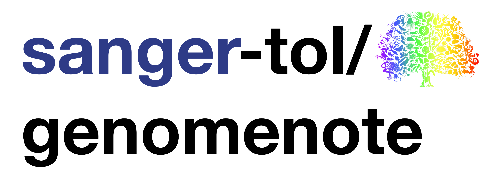

# 

[](https://github.com/sanger-tol/genomenote/actions?query=workflow%3A%22nf-core+linting%22)
[](https://doi.org/10.5281/zenodo.7949384)

[](https://www.nextflow.io/)
[](https://docs.conda.io/en/latest/)
[](https://www.docker.com/)
[](https://sylabs.io/docs/)
[](https://tower.nf/launch?pipeline=https://github.com/sanger-tol/genomenote)

[](https://twitter.com/SangerToL)

## Introduction

**sanger-tol/genomenote** is a bioinformatics pipeline that takes aligned HiC reads, creates contact maps and chromosomal grid using Cooler, and display on a [HiGlass server](https://genome-note-higlass.tol.sanger.ac.uk/app). The pipeline also collates (1) assembly information, statistics and chromosome details from NCBI datasets, (2) genome completeness from BUSCO, (3) consensus quality and k-mer completeness from MerquryFK, (4) HiC primary mapped percentage from samtools flagstat and optionally (5) Annotation statistics from AGAT and BUSCO. The pipeline combines the calculated statistics and collated assembly metadata with a template document to output a genome note document.

<!---->

1. Fetches genome metadata from [ENA](https://www.ebi.ac.uk/ena/browser/api/#/ENA_Browser_Data_API), [NCBI](https://www.ncbi.nlm.nih.gov/datasets/docs/v2/reference-docs/rest-api), and [GoaT](https://goat.genomehubs.org/api-docs/)
2. Summary statistics ([`NCBI datasets summary genome accession`](https://www.ncbi.nlm.nih.gov/datasets/docs/v2/reference-docs/command-line/datasets/summary/genome/datasets_summary_genome_accession/))
3. Convert alignment to BED ([`samtools view`](https://www.htslib.org/doc/samtools-view.html), [`bedtools bamtobed`](https://bedtools.readthedocs.io/en/latest/content/tools/bamtobed.html))
4. Filter BED ([`GNU sort`](https://www.gnu.org/software/coreutils/manual/html_node/sort-invocation.html), [`filter bed`](https://raw.githubusercontent.com/sanger-tol/genomenote/main/bin/filter_bed.sh))
5. Contact maps ([`Cooler cload`](https://cooler.readthedocs.io/en/latest/cli.html#cooler-cload-pairs), [`Cooler zoomify`](https://cooler.readthedocs.io/en/latest/cli.html#cooler-zoomify), [`Cooler dump`](https://cooler.readthedocs.io/en/latest/cli.html#cooler-dump))
6. Genome completeness ([`NCBI API`](https://www.ncbi.nlm.nih.gov/datasets/docs/v1/reference-docs/rest-api/), [`BUSCO`](https://busco.ezlab.org))
7. Consensus quality and k-mer completeness ([`FASTK`](https://github.com/thegenemyers/FASTK), [`MERQURY.FK`](https://github.com/thegenemyers/MERQURY.FK))
8. Collated summary table ([`createtable`](bin/create_table.py))
9. Optionally calculates some annotation statistics and completeness , ([`AGAT`](https://github.com/NBISweden/AGAT), [`BUSCO`](https://busco.ezlab.org))
10. Combines calculated statisics and assembly metadata with a template file to produce a genome note document.
11. Present results and visualisations ([`MultiQC`](http://multiqc.info/), [`R`](https://www.r-project.org/))

## Usage

> **Note**
> If you are new to Nextflow and nf-core, please refer to [this page](https://nf-co.re/docs/usage/installation) on how
> to set-up Nextflow. Make sure to [test your setup](https://nf-co.re/docs/usage/introduction#how-to-run-a-pipeline)
> with `-profile test` before running the workflow on actual data.

First, prepare a samplesheet with your input data that looks as follows:

`samplesheet.csv`:

```csv
sample,datatype,datafile
mMelMel3,hic,/analysis/mMelMel3.2_paternal_haplotype/read_mapping/hic/GCA_922984935.2.unmasked.hic.mMelMel3.cram
mMelMel3,pacbio,/genomic_data/mMelMel3/pacbio/kmer/k31
```

Each row represents an aligned HiC reads file, an unaligned PacBio/10X reads file, or a PacBio/10X k-mer database.

Now, you can run the pipeline using:

```bash
nextflow run sanger-tol/genomenote \
   -profile <docker/singularity/.../institute> \
   --input samplesheet.csv \
   --fasta genome.fasta \
   --assembly GCA_922984935.2 \
   --biosample_wgs SAMEA112198456 \
   --biosample_hic SAMEA112198479 \
   --biosample_rna SAMEA112232914 \
   --outdir <OUTDIR>
```

> **Warning:**
> Please provide pipeline parameters via the CLI or Nextflow `-params-file` option. Custom config files including those
> provided by the `-c` Nextflow option can be used to provide any configuration _**except for parameters**_;
> see [docs](https://nf-co.re/usage/configuration#custom-configuration-files).

For more details, please refer to the [usage documentation](https://pipelines.tol.sanger.ac.uk/genomenote/usage) and the [parameter documentation](https://pipelines.tol.sanger.ac.uk/genomenote/parameters).

## Credits

sanger-tol/genomenote was originally written by [Priyanka Surana](https://github.com/priyanka-surana).

We thank the following people for their assistance in the development of this pipeline:

- [Matthieu Muffato](https://github.com/muffato)
- [Beth Yates](https://github.com/BethYates)
- [Shane McCarthy](https://github.com/mcshane) and [Yumi Sims](https://github.com/yumisims) for providing software and algorithm guidance.
- [Cibin Sadasivan Baby](https://github.com/cibinsb) for providing reviews.

## Contributions and Support

If you would like to contribute to this pipeline, please see the [contributing guidelines](.github/CONTRIBUTING.md).

## Citations

If you use sanger-tol/genomenote for your analysis, please cite it using the following doi: [10.5281/zenodo.7949384](https://doi.org/10.5281/zenodo.7949384)

An extensive list of references for the tools used by the pipeline can be found in the [`CITATIONS.md`](CITATIONS.md) file.

This pipeline uses code and infrastructure developed and maintained by the [nf-core](https://nf-co.re) community, reused here under the [MIT license](https://github.com/nf-core/tools/blob/master/LICENSE).

> **The nf-core framework for community-curated bioinformatics pipelines.**
>
> Philip Ewels, Alexander Peltzer, Sven Fillinger, Harshil Patel, Johannes Alneberg, Andreas Wilm, Maxime Ulysse Garcia, Paolo Di Tommaso & Sven Nahnsen.
>
> _Nat Biotechnol._ 2020 Feb 13. doi: [10.1038/s41587-020-0439-x](https://dx.doi.org/10.1038/s41587-020-0439-x).
